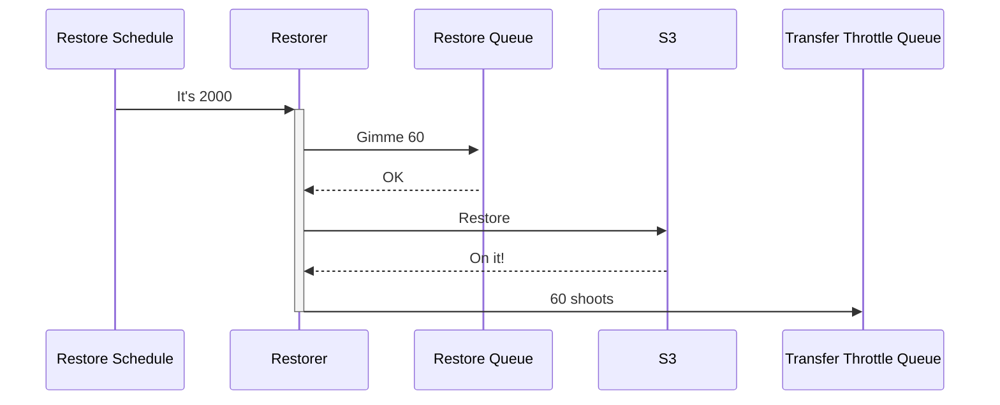
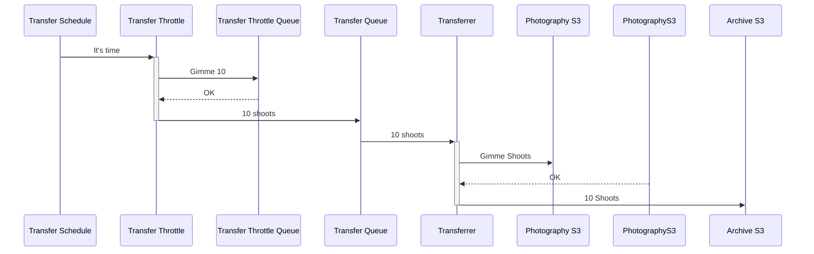

# Restore and Transfer pipeline
## How does it all fit together?

In the evening, the Restorer 
* Pulls a day's worth of shoots from the restore
* Restores the from Glacier
* Notifies the transfer throttle queue.

Restoration takes a nondeterministic amount of time up to 12 hours

Across the day, the transfer throttle 
* pulls a manageable quantity from its queue
* shifts them onto the transfer queue

The transferrer then transfers everything on its queue

