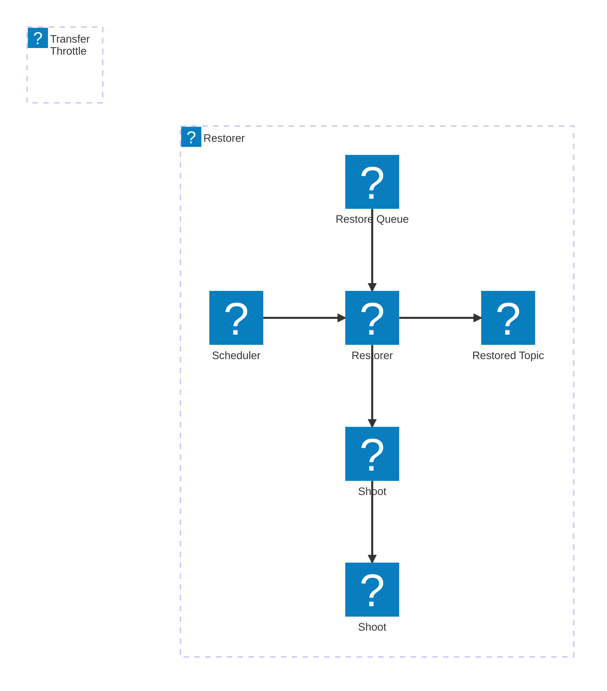

Hello 

```mermaid
architecture-beta
    group platform(logos:aws)[Restorer]

    service to_restore(logos:aws-sqs)[Restore Queue] in platform
    service restore_scheduler(logos:aws-eventbridge)[Scheduler] in platform
    service restorer_lambda(logos:aws-lambda)[Restorer] in platform
    service shoot_cold(logos:aws-glacier)[Shoot] in platform
    service restored_topic(logos:aws-sns)[Restored Topic] in platform
    service shoot_warm(logos:aws-s3)[Shoot] in platform

    restore_scheduler: R --> L : restorer_lambda
    to_restore:B --> T: restorer_lambda
    restorer_lambda:B --> T: shoot_cold
    shoot_cold:B --> T: shoot_warm
    restorer_lambda:R --> L: restored_topic

    group digitisation(logos:aws)[Transfer Throttle]

```